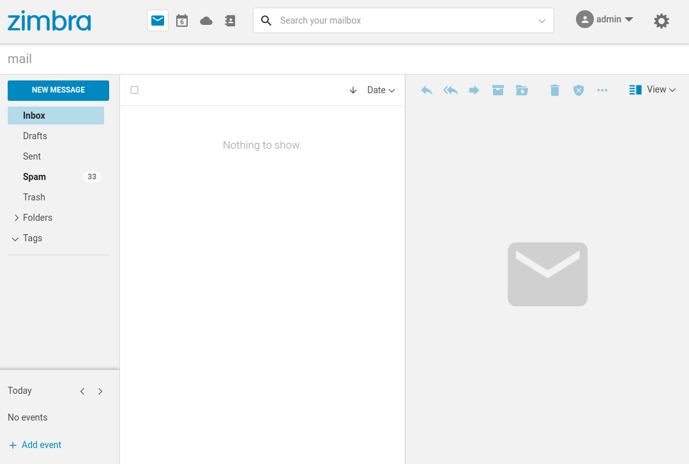

# Automated installation of Zimbra and Lets Encrypt

This article introduces the `zinstaller` script that can be used for automating the installation of Zimbra. The `zinstaller` script will install a Zimbra 10 single server on Ubuntu 20 and will also obtain and install a 60-day trial license.

If you are new to Zimbra, the `zinstaller` script makes it easy to evaluate Zimbra on premise. If you already run Zimbra you can use `zinstaller` to preview the latest features. Developers can use `zinstaller` as an easy way to set-up a development server.

## Running the script

If your mail server is reachable under mail.example.com and you want your email addresses to look like info@example.com, you can run `zinstaller` as follows:

```
wget https://raw.githubusercontent.com/Zimbra/zinstaller/master/zinstaller -O /root/zinstaller
chmod +x /root/zinstaller
/root/zinstaller -p put-a-password-here -n mail -t 'Europe/London' -a n --letsencrypt y example.com

```

Having a poor connection over SSH? Try using `screen`:

```
apt -y install screen
screen
wget https://raw.githubusercontent.com/Zimbra/zinstaller/master/zinstaller -O /root/zinstaller
chmod +x /root/zinstaller
/root/zinstaller -p put-a-password-here -n mail -t 'Europe/London' -a n --letsencrypt y example.com
```
Should your connection drop, you can use the ssh command like normal and resume your session using:

```
screen -r
```

## Certificate renewal

The `zinstaller` set's up a daily cron job to renew and deploy the Let's Encrypt certificate on Zimbra, you must however restart Zimbra manually at a suitable time for the new certificate to be used. To do this issue `sudo su zimbra -c "/opt/zimbra/bin/zmcontrol restart"` on the command line.

## Screenshots


*Installed trial license.*


*Modern UI after installation.*
